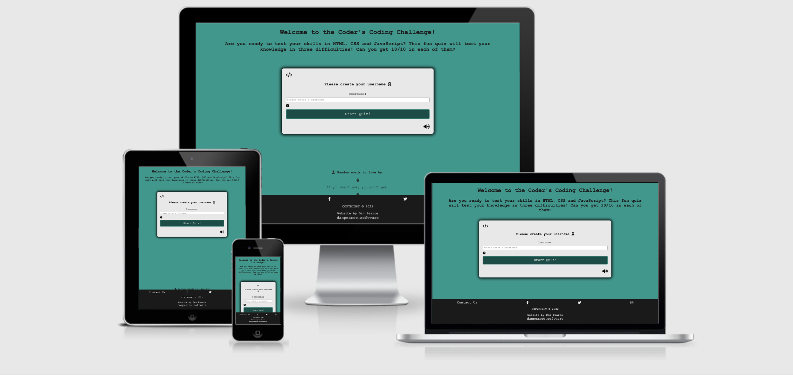

# Coder's Coding Challenege! - Test your knowledge in HTML, CSS and JavaScript!
Developed by, [Dan Pearce](https://danpearce.software/)

[View the live site](https://danpearce.github.io/CI_PP2_Coding_Challenge_Quiz/index.html)

The Coder's Coding Challenge Quiz App/Website is designed to encourage people to test their skills in HTML, CSS and JavaScript! It's inteneded to be a fun interactive site that allows the user to choose a difficulty and give them feedback on how they are scoring throughout the quiz.

The site has been designed with simplicity in mind allowing the main focus to be the game, with other features pushed to the bottom of the page.

##Contents
1. [Site Goals and Consumer Experience](#site-goals-and-consumer-experience)
    - [Consumer Goals](#consumer-goals)
    - [Website Owner Goals](#website-owner-goals)
    - [Target Audience](#target-audience)
    - [Consumer Expectations](#consumer-expectations)
2. [User Stories](#user-stories)
    - [User](#user)
    - [Website Owner](#website-owner)
3. [Design](#design)
    - [Structure](#structure)
    - [Wireframes](#wireframes)
    - [Colour](#colour)
    - [Font](#font)
    - [Icons](#icons)
4. [Game Features](#game-features)
5. [Technologies](#technologies)
    - [Languages](#languages)
    - [API](#api)
    - [Frameworks and Other Technologies](#frameworks-and-other-technologies)
6. [Validation and Testing](#validation-and-testing)
    - [HTML Validation](#html-validation)
    - [CSS Validation](#css-validation)
    - [JavaScript Validation](#javascript-validation)
    - [Accessibility Validation](#accessibility-validation)
    - [Performance Validation](#performance-validation)
    - [Device and Browser Compatibility](#device-and-browser-compatibility)
    - [User Story Testing](#user-story-testing)
7. [Bugs and Errors](#bugs-and-errors)
8. [Deployment](#deployment)
9. [Credits](#credits)
    - [Images](#images)
    - [Quiz Contents](#quiz-contents)
    - [Code](#code)
10. [Acknowledgements](#acknowledgements)

## Site Goals and Consumer Experience

##Consumer Goals
- Easily navigate around the quiz.
- Easily distinguish between a correct and incorrect answer.
- Test their skills in HTML, CSS and JavaScript.
- Contact the website owner for suggestions/errors.

##Website Owner Goals
- Provide the consumer feedback on how they scored throughout and at the end of the game.
- Provide an experience that is fully responsive.
- Provide a point of contact so that the consumer can contact about bugs or future devlopments.

##Target Audience
- Beginner/Moderate students or casual coders who wish to test their skills in these languages.
- Students/coder's that like to be tested through a quiz.
- Anyone with an interest in coding, looking to test and expand their knowledge.

##Consumer Expectations
- A fully responsive site that can be accessed on all devices without error.
- Easily distinguishable sections and design.
- An interactive fun game experience with ease of use in mind.
- Easy and simple navigation throughout the site.
- Fully functioning links with no pages that lead to errors or dead links.
- Accessibility throughout the website.