# Coder's Coding Challenege! - Test your knowledge in HTML, CSS and JavaScript!
Developed by, [Dan Pearce](https://danpearce.software/)

[View the live site](https://danpearce.github.io/CI_PP2_Coding_Challenge_Quiz/index.html)

The Coder's Coding Challenge Quiz App/Website is designed to encourage people to test their skills in HTML, CSS and JavaScript! It's inteneded to be a fun interactive site that allows the user to choose a difficulty and give them feedback on how they are scoring throughout the quiz.

The site has been designed with simplicity in mind allowing the main focus to be the game, with other features pushed to the bottom of the page.

##Contents
1. [Site Goals and Consumer Experience](#site-goals-and-consumer-experience)
    - [Consumer Goals](#consumer-goals)
    - [Website Owner Goals](#website-owner-goals)
    - [Target Audience](#target-audience)
    - [Consumer Expectations](#consumer-expectations)
2. [User Stories](#user-stories)
    - [User](#user)
    - [Website Owner](#website-owner)
3. [Design](#design)
    - [Structure](#structure)
    - [Wireframes](#wireframes)
    - [Colour](#colour)
    - [Font](#font)
    - [Icons](#icons)
4. [Game Features](#game-features)
5. [Technologies](#technologies)
    - [Languages](#languages)
    - [API](#api)
    - [Frameworks and Other Technologies](#frameworks-and-other-technologies)
6. [Validation and Testing](#validation-and-testing)
    - [HTML Validation](#html-validation)
    - [CSS Validation](#css-validation)
    - [JavaScript Validation](#javascript-validation)
    - [Accessibility Validation](#accessibility-validation)
    - [Performance Validation](#performance-validation)
    - [Device and Browser Compatibility](#device-and-browser-compatibility)
    - [User Story Testing](#user-story-testing)
7. [Bugs and Errors](#bugs-and-errors)
8. [Deployment](#deployment)
9. [Credits](#credits)
    - [Images](#images)
    - [Quiz Contents](#quiz-contents)
    - [Code](#code)
10. [Acknowledgements](#acknowledgements)

## Site Goals and Consumer Experience

### Consumer Goals
- Easily navigate around the quiz.
- Easily distinguish between a correct and incorrect answer.
- Test their skills in HTML, CSS and JavaScript.
- Contact the website owner for suggestions/errors.

### Website Owner Goals
- Provide the consumer feedback on how they scored throughout and at the end of the game.
- Provide an experience that is fully responsive.
- Provide a point of contact so that the consumer can contact about bugs or future devlopments.

### Target Audience
- Beginner/Moderate students or casual coders who wish to test their skills in these languages.
- Students/coder's that like to be tested through a quiz.
- Anyone with an interest in coding, looking to test and expand their knowledge.

### Consumer Expectations
- A fully responsive site that can be accessed on all devices without error.
- Easily distinguishable sections and design.
- An interactive fun game experience with ease of use in mind.
- Easy and simple navigation throughout the site.
- Fully functioning links with no pages that lead to errors or dead links.
- Accessibility throughout the website.

## User Stories

### User
1. As a user, I want to be able to test my knowledge in HTML, CSS, and JavaScript with an ineractive quiz.
2. As a user, I want to be able to choose the level of difficulty I want to be tested at.
3. As a user, I want to be able to distingish between when I got an answer correct or an answer incorrect.
4. As a user, I want to know which answer was correct should I get the answer incorrect.
5. As a user, I want to be provided with a tally of the score I have recieved.
6. As a user, I want to be able to turn the sound off should I want to.
7. As a user, I want to provide feedback to the owner, and be informed that said feedback has been sent.

### Website Owner
8. As an owner, I want to provide a site that is fully responsive for all users.
10. As an owner, I want the user to be notified when they have scored correctly/incorrectly. 
11. As an owner, I want to allow the user to send feedback directly to me about the site.
12. As an owner, I want the user to be aware of our social media presence at all times.
13. As an owner, I want the user to easily navigate back to the main quiz page should enter an incorrect URL.

## Design 

### Structure
For the site I wanted to provide the user a simple and easily followable structure. To do this I wanted the main focus to be the quiz and all other forms of navigation to be pushed to the bottom of the page in the footer.

#### Index Page
The index page is the main page so this is where the quiz is located. The quiz takes up considerable space and is the biggest section on the entire page.
- The page has a header, welcoming people to the site with detail about the site and quiz.
- The quiz section is just underneath the header and is fixed into place.
- The random advice API is located near the bottom of the page to allow the quiz to build space as the JavaScript inserts new code.
- The footer is fixed into place at the bottom of the page and is visable no matter where you are scrolling through the site.

#### Contact Us Page
The contact us page is the only other 'main' page on the site and uses the design from the quiz but instead holds a quiz inside.
- The form is simple and easy to read.
- Once submitted the JavaScript removes the form and displays the user with a screen that informs them their form has been submitted.

#### 404 Error Page
This page has been implemented to provide a fall back in case of input error to the URL to ensure the user can remain on the site. Agian keeping the same design structure from the main quiz.

### Wireframes

Index Page

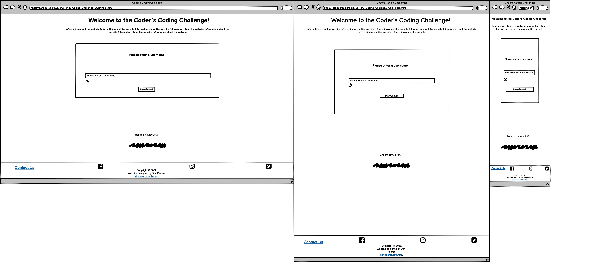

Welcome/Difficulty

Main Quiz

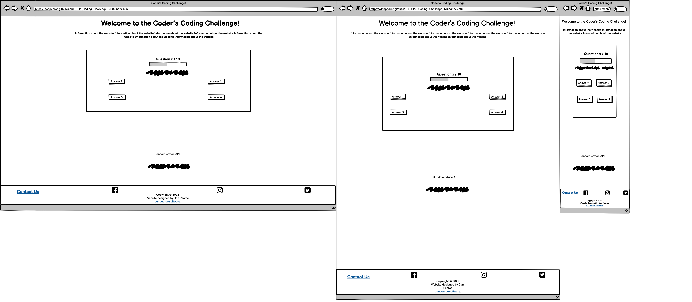

Next Question/Answers Revealed

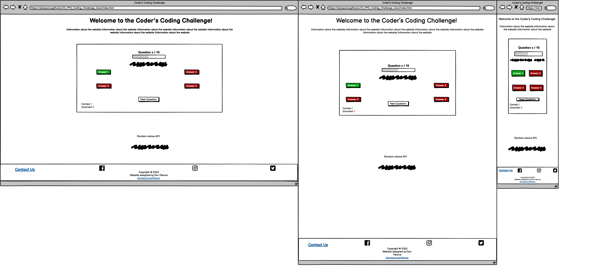

End of Quiz

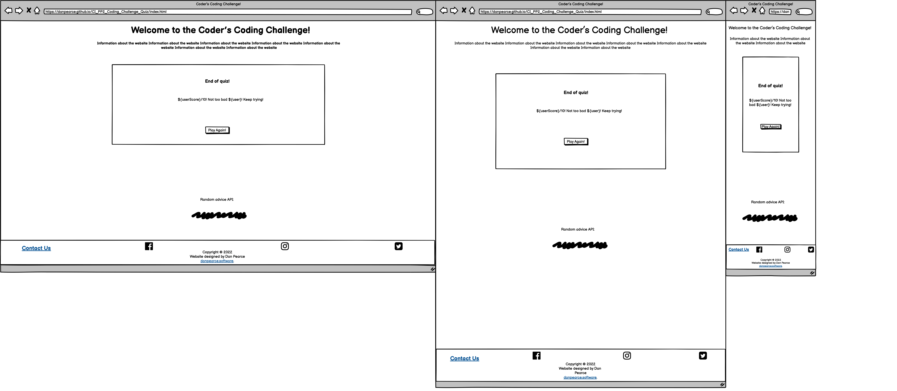

Contact Us Page

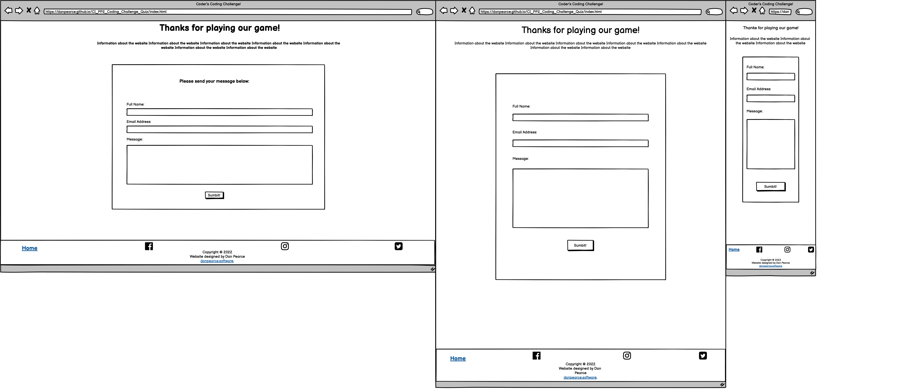

Form Sent

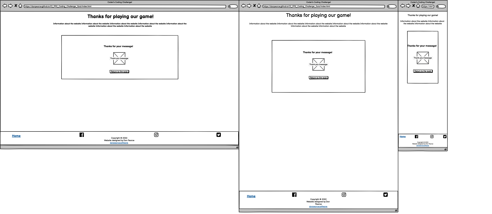

404 Error

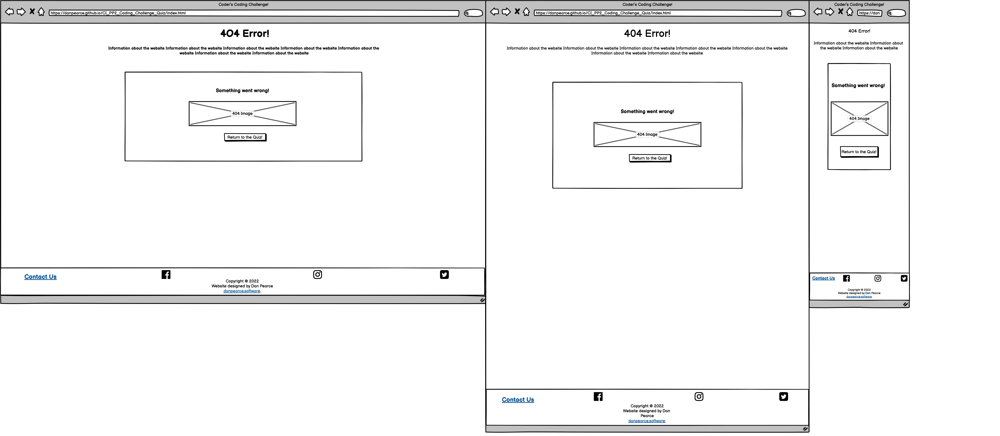

### Colour
The colouring of the site has been kept simple to make it clear to user's when they're on a normal page, when the have answered correctly, when they have answered incorrectly and when they have successfully sent a message using the form. This has been achieved by changing the background colour of the body through JavaScript.

Colour Palette

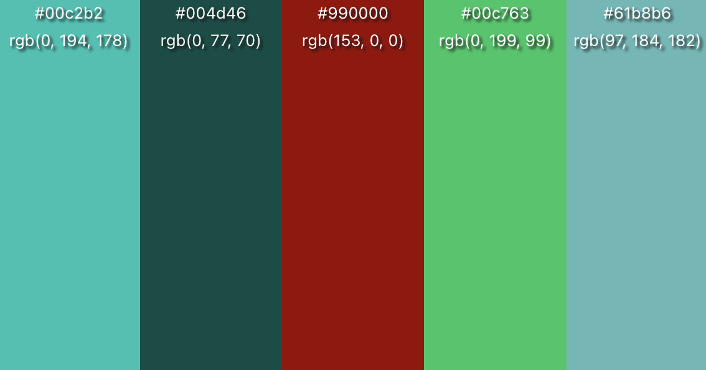

All of the pages were tested in terms of contrast using [WebAIM](https://webaim.org/)

#### Normal Contrast
The normal colour for the site is a turquoise colour and this is to distinguish to the user that this is neither a correct or incorrect page.

Normal Contrast

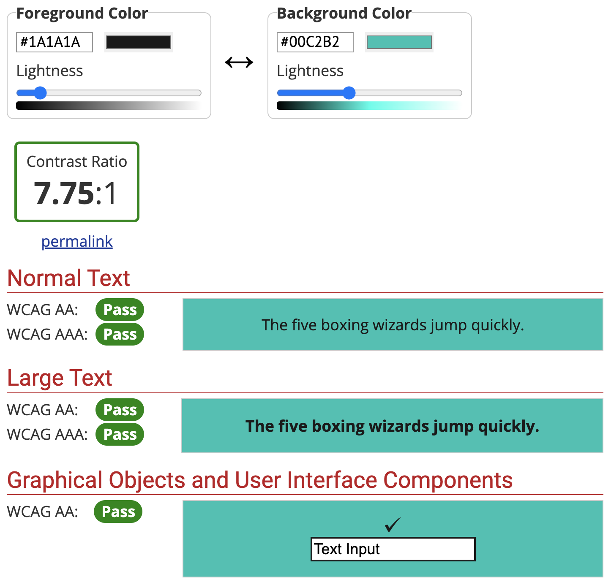

#### Correct Contrast
When a correct answer is clicked a green background is used.

Correct Contrast

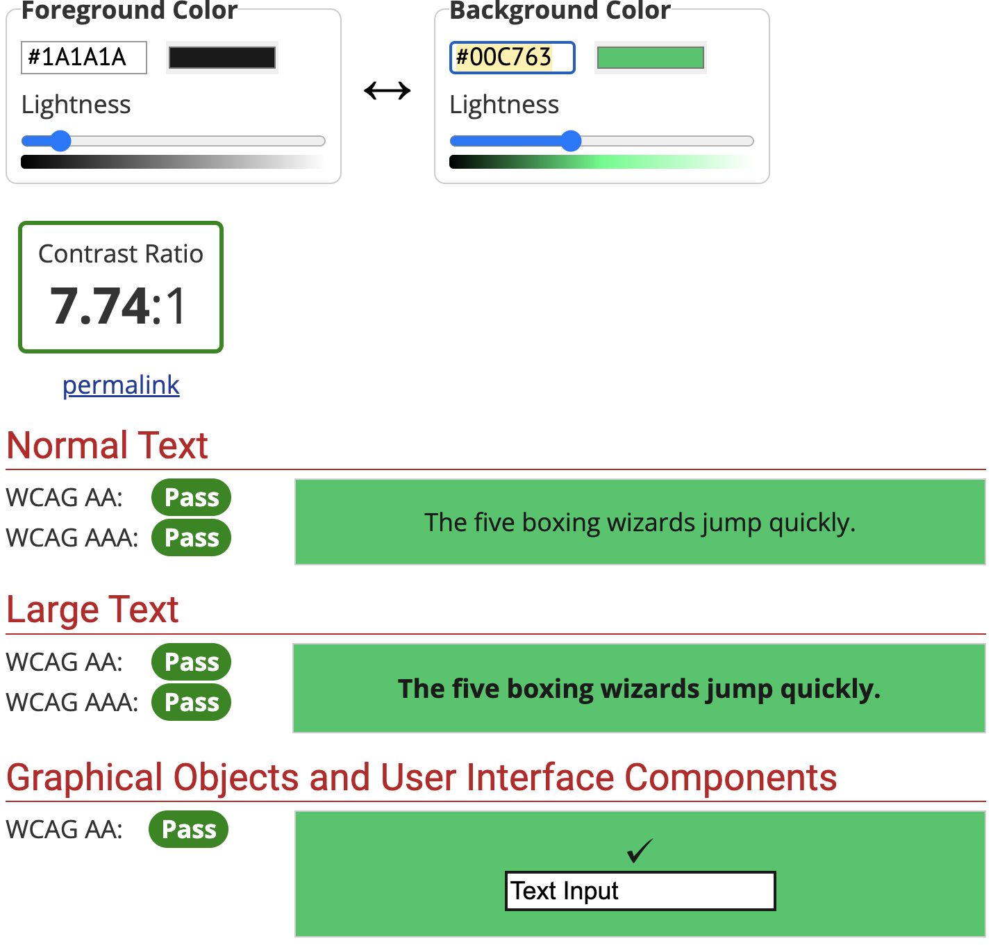

#### Incorrect Contrast
When an incorrect answer is clicked a red background is used and the font colour is change to a whiter colour.

Incorrect Contrast

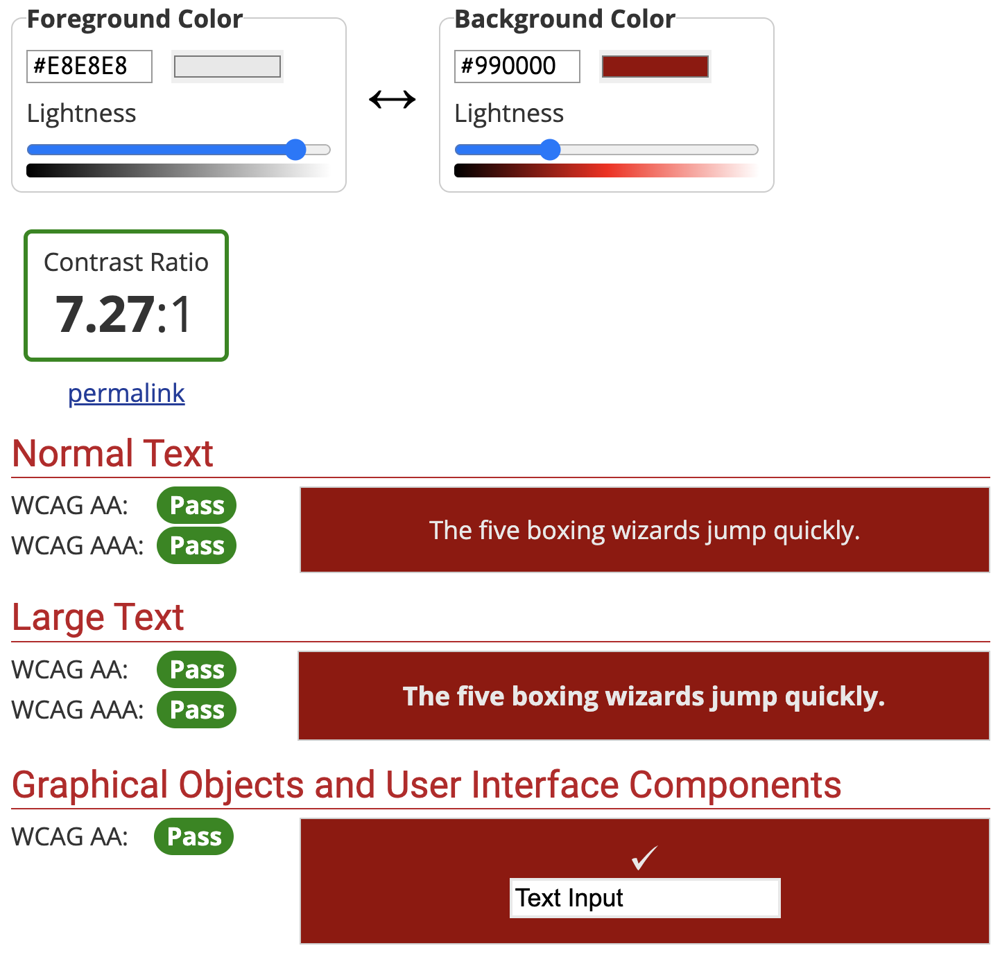

#### Form Sent Contrast
When the form has been sent, the background colour is changed to match the image used.

Form Sent Contrast

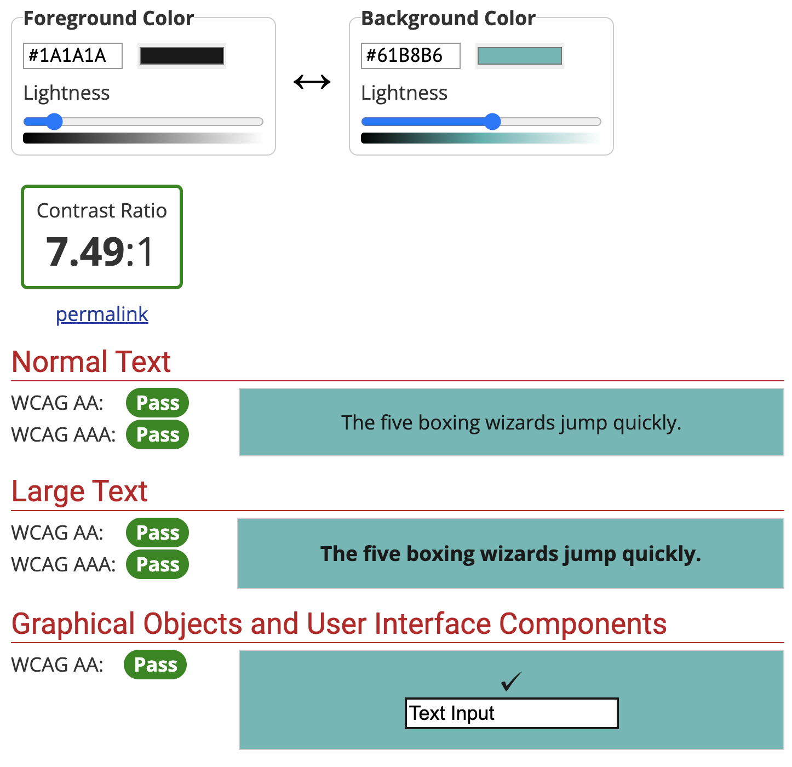

### Font

### Icons