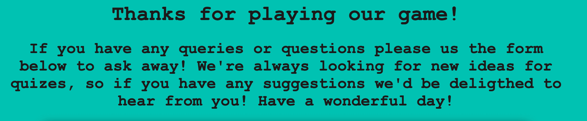
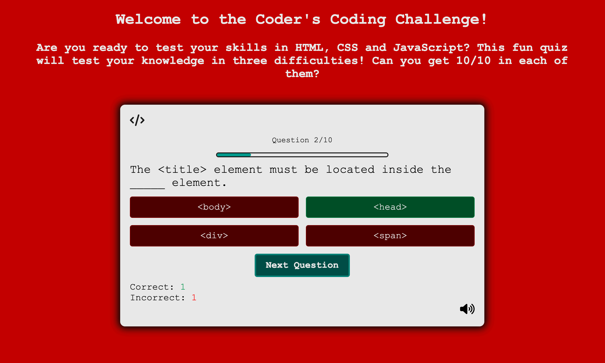
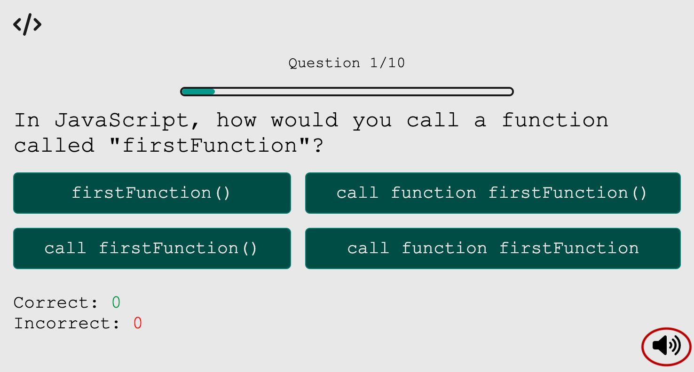
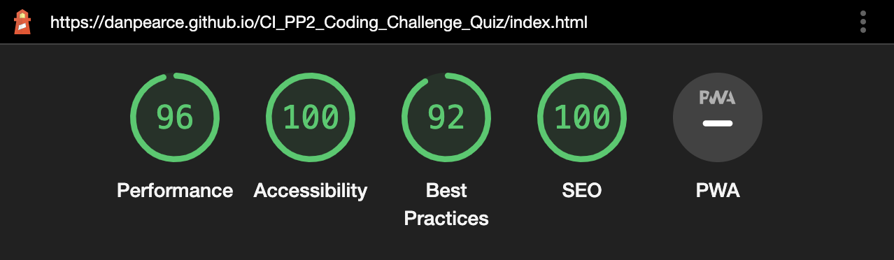

# Coder's Coding Challenege! - Test your knowledge in HTML, CSS and JavaScript!
Developed by, [Dan Pearce](https://danpearce.software/)

[View the live site](https://danpearce.github.io/CI_PP2_Coding_Challenge_Quiz/index.html)

The Coder's Coding Challenge Quiz App/Website is designed to encourage people to test their skills in HTML, CSS and JavaScript! It's inteneded to be a fun interactive site that allows the user to choose a difficulty and give them feedback on how they are scoring throughout the quiz.

The site has been designed with simplicity in mind allowing the main focus to be the game, with other features pushed to the bottom of the page.

##Contents
1. [Site Goals and Consumer Experience](#site-goals-and-consumer-experience)
    - [Consumer Goals](#consumer-goals)
    - [Website Owner Goals](#website-owner-goals)
    - [Target Audience](#target-audience)
    - [Consumer Expectations](#consumer-expectations)
2. [User Stories](#user-stories)
    - [User](#user)
    - [Website Owner](#website-owner)
3. [Design](#design)
    - [Structure](#structure)
    - [Wireframes](#wireframes)
    - [Colour](#colour)
    - [Font](#font)
    - [Icons](#icons)
4. [Main Features](#main-features)
5. [Technologies](#technologies)
    - [Languages](#languages)
    - [APIs](#apis)
    - [Frameworks and Other Technologies](#frameworks-and-other-technologies)
6. [Validation and Testing](#validation-and-testing)
    - [HTML Validation](#html-validation)
    - [CSS Validation](#css-validation)
    - [JavaScript Validation](#javascript-validation)
    - [Accessibility Validation](#accessibility-validation)
    - [Performance Validation](#performance-validation)
    - [Device and Browser Compatibility](#device-and-browser-compatibility)
    - [User Story Testing](#user-story-testing)
7. [Bugs and Errors](#bugs-and-errors)
8. [Deployment](#deployment)
9. [Credits](#credits)
    - [Images](#images)
    - [Quiz Contents](#quiz-contents)
    - [Code](#code)
10. [Acknowledgements](#acknowledgements)

## Site Goals and Consumer Experience

### Consumer Goals
- Easily navigate around the quiz.
- Easily distinguish between a correct and incorrect answer.
- Test their skills in HTML, CSS and JavaScript.
- Contact the website owner for suggestions/errors.

### Website Owner Goals
- Provide the consumer feedback on how they scored throughout and at the end of the game.
- Provide an experience that is fully responsive.
- Provide a point of contact so that the consumer can contact about bugs or future devlopments.

### Target Audience
- Beginner/Moderate students or casual coders who wish to test their skills in these languages.
- Students/coder's that like to be tested through a quiz.
- Anyone with an interest in coding, looking to test and expand their knowledge.

### Consumer Expectations
- A fully responsive site that can be accessed on all devices without error.
- Easily distinguishable sections and design.
- An interactive fun game experience with ease of use in mind.
- Easy and simple navigation throughout the site.
- Fully functioning links with no pages that lead to errors or dead links.
- Accessibility throughout the website.

## User Stories

### User
1. As a user, I want to be able to test my knowledge in HTML, CSS, and JavaScript with an ineractive quiz.
2. As a user, I want to be able to choose the level of difficulty I want to be tested at.
3. As a user, I want to be able to distingish between when I got an answer correct or an answer incorrect.
4. As a user, I want to know which answer was correct should I get the answer incorrect.
5. As a user, I want to be provided with a tally of the score I have recieved.
6. As a user, I want to be able to turn the sound off should I want to.
7. As a user, I want to provide feedback to the owner, and be informed that said feedback has been sent.

### Website Owner
8. As an owner, I want to provide a site that is fully responsive for all users.
9. As an owner, I want the user to be notified when they have scored correctly/incorrectly. 
10. As an owner, I want to allow the user to send feedback directly to me about the site.
11. As an owner, I want the user to be aware of our social media presence at all times.
12. As an owner, I want the user to easily navigate back to the main quiz page should enter an incorrect URL.

## Design 

### Structure
For the site I wanted to provide the user a simple and easily followable structure. To do this I wanted the main focus to be the quiz and all other forms of navigation to be pushed to the bottom of the page in the footer.

#### Index Page
The index page is the main page so this is where the quiz is located. The quiz takes up considerable space and is the biggest section on the entire page.
- The page has a header, welcoming people to the site with detail about the site and quiz.
- The quiz section is just underneath the header and is fixed into place.
- The random advice API is located near the bottom of the page to allow the quiz to build space as the JavaScript inserts new code.
- The footer is fixed into place at the bottom of the page and is visable no matter where you are scrolling through the site.

#### Contact Us Page
The contact us page is the only other 'main' page on the site and uses the design from the quiz but instead holds a quiz inside.
- The form is simple and easy to read.
- Once submitted the JavaScript removes the form and displays the user with a screen that informs them their form has been submitted.

#### 404 Error Page
This page has been implemented to provide a fall back in case of input error to the URL to ensure the user can remain on the site. Agian keeping the same design structure from the main quiz.

### Wireframes

Index Page

Welcome/Difficulty

Main Quiz

Next Question/Answers Revealed

End of Quiz

Contact Us Page

Form Sent

404 Error

### Colour
The colouring of the site has been kept simple to make it clear to user's when they're on a normal page, when the have answered correctly, when they have answered incorrectly and when they have successfully sent a message using the form. This has been achieved by changing the background colour of the body through JavaScript.

Colour Palette

All of the pages were tested in terms of contrast using [WebAIM](https://webaim.org/)

#### Normal Contrast
The normal colour for the site is a turquoise colour and this is to distinguish to the user that this is neither a correct or incorrect page.

Normal Contrast

#### Correct Contrast
When a correct answer is clicked a green background is used.

Correct Contrast

#### Incorrect Contrast
When an incorrect answer is clicked a red background is used and the font colour is change to a whiter colour.

Incorrect Contrast

#### Form Sent Contrast
When the form has been sent, the background colour is changed to match the image used.

Form Sent Contrast

### Font
The font used on this website is [Courier New]('https://docs.microsoft.com/en-us/typography/font-list/courier-new) and this was chosen specifically for it's retro feel for computers - I thought this was particularly relevent as the quiz is related to coding!

### Icons
I used [favicon.io](https://favicon.io/) to create the favicon icons for the site, and used [Roboto](https://fonts.google.com/specimen/Roboto/) as the font for this as I thought this looked the most traditional for the classic '</>' code symbol. The colours are also featured on the site to stay consistent with styling.

Icons from [Font Awesome](https://fontawesome.com/) we're also used throughout the site, notably the home button on the quiz, the sound controls and the social media links also.

## Main Features
The features of this website are all combined to create a fully functioning quiz with added sounds and colours to create an interactive experience for all. 

### Header 
At the top of the webpage the header is prominent and gives the consumer a welcome message and underneath details the use of the current page that they are on. The header is changed depending on which page they are currently on and this allows the user to understand what each page does.

Header Index Page

Header Contact Us Page

Header 404 Error Page

### Username 
The site implements the use of a username! The user is prompted to enter a username upon the page opening - which is then used to welcome the user on the next page. This username is also displayed at the end of the quiz to inform the user of their score.

Username Entry

Welcome User

User with Score

### Game Modes 
The game allows the user to decide which level of questions they would like to be challenged with in the quiz. This is avaliable immediatly after they enter a username and comes in Easy, Moderate and Hard and the questions will change accordingly.

Game Modes

### Main Game and Game Controls
Upon deciding which game mode to play, the user will be brought to the first question which is shuffled randomly to make the game slightly harder if replaying. 

#### Main Game
The functionality is simple, the user has to pick an answer out of four choices.

Main Game

#### Question Counter
At the top of the quiz section the quiz counter can be seen providing the user a visual counter on how far through the quiz they are and also providing a numerical counter too.

Question Counter

#### Correct and Incorrect Answers
The user will pick an answer and depedning on whether they got it correct or not the game will give several visual clues to support the answer they picked.

The buttons will all change colour including the one they selected; the correct one will be green and the incorrect ones will be red.

Buttons Answer Clicked

The main body will change to green if they chose the correct answer.

Correct Body

The main body will change to red if they chose an incorrect answer.

Incorrect Body

#### Score 
The score is featured near the bottom of the quiz container. The correct/incorrect score will increment depending on which answer the user clicks.

Score Area

Score Example

#### Audio Controls
Throughout the game there are several audio cues that play when buttons are clicked and answers have been clicked. In order to control the audio there is an implemented audio symbol that allows the user to turn audio on or off.

Audio On

Audio Off

#### End Game
At the end of the quiz the user is shown their result and is also given a personalised message depending on which result they got.

End Game

### Random Advice API
Underneath the quiz the user is dispalyed a random peice of advice, generated from the random advice API.

Random Advice API

### Footer
At the bottom of each page the footer is fixed into place to provide the user a form of consistent navigation between the pages - and to showcase the social media links

Footer

 

### Contact Us Page 
The site features a contact us page which uses the same styling as the home page.

Contact Us Page

#### Form 
The contact form area allows the user to input their details and a message that will be sent directly to the owner.

Form Area

#### Form Sent
Once the contact form has been submitted successfully the user is displayed with a new message which informs them it has been sent successfully.

Form Sent

### 404 Error Page
The 404 error page provides a fall back for the user should they enter an incorrect URL extension to the website. The page features an image with relating text and a button for the user to navigate home.

404 Error Page

## Technologies

### Languages
- [HTML](https://en.wikipedia.org/wiki/HTML5)
- [CSS](https://en.wikipedia.org/wiki/CSS)
- [JavaScript](https://en.wikipedia.org/wiki/JavaScript)

### APIs
- [Advice Slip](https://api.adviceslip.com/)

### Frameworks and Other Technologies
- [GitHub](https://github.com/)
- [GitPod](https://www.gitpod.io/)
- [Font Awesome](https://fontawesome.com/)
- [Balsamiq](https://balsamiq.com/)
- [Google Chrome Developer Tools](https://developers.google.com/web/tools/chrome-devtools)
- [Google Fonts](https://fonts.google.com/)
- [Favicon.io](https://favicon.io/)
- [Tiny PNG](https://tinypng.com/)
- [Email JS](https://www.emailjs.com/)

## Validation and Testing

### HTML Validation 
The HTML has been tested using the [W3C Markup Validation Service](https://validator.w3.org/) in order validate the correct function of this site. All pages have passed with no errors or warnings.

Index Page Validation

Contact Us Page Validation

404 Error Page Validation

### CSS Validation
The [W3C Jigsaw Validation Service](https://jigsaw.w3.org/css-validator/) has been used to test the CSS of this website. The CSS has passed with no errors.

CSS Validation

### JavaScript Validation
[JSHint](https://jshint.com/) was used to test the JavaScript of this site and all js files have passed with no errors.

Game JS Validation

Audio Js Validation

Form JS Validation

Random Advice JS Validation

Questions JS Validation

### Accessibility Validation
The [WAVE - Web Accessibility Evaluation Tool](https://wave.webaim.org/) was used to test the accessibility function of the website, all pages have passed with no errors.

Index Page WAVE Validation

Contact Us Page WAVE Validation

404 Error Page WAVE Validation

### Performance Validation
[Lighthouse](https://developers.google.com/web/tools/lighthouse) in the Google Chrome Developer Tools was used to test the performance of the website and all pages have passed with a green score.

Index Page Performance

Contact US Page Performance

404 Error Page Performance

### Device and Browser Compatibility 

#### Device Testing
This website and game was tested on numerous devices all of which result with full functionality and no visual issues the devices I tested on were as followed:
- MacBook Pro 16-inch 
- Desktop PC with 32-inch screen.
- iPhone 12 Pro
- iPad Pro 11inch
- Microsoft Surface Pro 3
- This site was also tested on all defeault Google Chrome Developer Tool screen sizes.

#### Browser Compatibility
The project was tested and viewed on the following browsers with no errors:
- [Google Chrome](https://en.wikipedia.org/wiki/Google_Chrome)
- [Mozilla Firefox](https://en.wikipedia.org/wiki/Firefox)
- [Microsoft Edge](https://en.wikipedia.org/wiki/Microsoft_Edge)
- [Apple Safari](https://en.wikipedia.org/wiki/Safari_(web_browser))

### User Story Testing 

| **User Story 1** | **User Action** | **Desired Outcome** | **Actual Outcome** |
|----------------|------------------|---------------------|--------------------|
| As a user, I want to be able to test my knowledge in HTML, CSS, and JavaScript with an ineractive quiz. | Load the webpage | The user to be able to play an interactive quiz | Works as intended |

User Story 1 Supporting Screenshots

| **User Story 2** | **User Action** | **Desired Outcome** | **Actual Outcome** |
|----------------|------------------|---------------------|--------------------|
| As a user, I want to be able to choose the level of difficulty I want to be tested at. | Click the game difficulty they wish to play | Display a different set of questions based on the clicked response | Works as intended |

User Story 2 Supporting Screenshots

| **User Story 3** | **User Action** | **Desired Outcome** | **Actual Outcome** |
|----------------|------------------|---------------------|--------------------|
| As a user, I want to be able to distingish between when I got an answer correct or an answer incorrect. | Click an answer | To be told visually about a correct/incorrect answer through the use of colour | Works as intended |

User Story 3 Supporting Screenshots

| **User Story 4** | **User Action** | **Desired Outcome** | **Actual Outcome** |
|----------------|------------------|---------------------|--------------------|
| As a user, I want to know which answer was correct should I get the answer incorrect. | Click an answer | To be shown the correct answer, even if the answer clicked was incorrect | Works as intended |

User Story 4 Supporting Screenshots

| **User Story 5** | **User Action** | **Desired Outcome** | **Actual Outcome** |
|----------------|------------------|---------------------|--------------------|
| As a user, I want to be provided with a tally of the score I have recieved. | Play the game as normal | Score to be displayed at the bottom of the quiz, and a tally at the end of the quiz | Works as intended |

User Story 5 Supporting Screenshots

| **User Story 6** | **User Action** | **Desired Outcome** | **Actual Outcome** |
|----------------|------------------|---------------------|--------------------|
| As a user, I want to be able to turn the sound off should I want to. | a | b | c |

User Story 6 Supporting Screenshots

| **User Story 7** | **User Action** | **Desired Outcome** | **Actual Outcome** |
|----------------|------------------|---------------------|--------------------|
| As a user, I want to provide feedback to the owner, and be informed that said feedback has been sent. | Click the contact us page, fill out the form correctly and click submit. | The form will disappear and the submitted page will take it's place | Works as intended |

User Story 7 Supporting Screenshots

| **User Story 8** | **User Action** | **Desired Outcome** | **Actual Outcome** |
|----------------|------------------|---------------------|--------------------|
| As an owner, I want to provide a site that is fully responsive for all users. | Load on various devices | The webpage to be fully responsive, regardless of screen size | Works as intended |

User Story 8 Supporting Screenshots

| **User Story 9** | **User Action** | **Desired Outcome** | **Actual Outcome** |
|----------------|------------------|---------------------|--------------------|
| As an owner, I want the user to be notified when they have scored correctly/incorrectly. | Click an answer | The body will visually change colour depending on the answer clicked | Works as intended |

User Story 9 Supporting Screenshots

| **User Story 10** | **User Action** | **Desired Outcome** | **Actual Outcome** |
|----------------|------------------|---------------------|--------------------|
| As an owner, I want to allow the user to send feedback directly to me about the site. | Click the contact us page, submit the form with no errors | A form to be provided on the site for communication between user and owner | Works as intended |

User Story 10 Supporting Screenshots

| **User Story 11** | **User Action** | **Desired Outcome** | **Actual Outcome** |
|----------------|------------------|---------------------|--------------------|
| As an owner, I want the user to be aware of our social media presence at all times. | Navigate to the footer of the page | The social media links are visible at all times on the page | Works as intended |

User Story 11 Supporting Screenshots

| **User Story 12** | **User Action** | **Desired Outcome** | **Actual Outcome** |
|----------------|------------------|---------------------|--------------------|
| As an owner, I want the user to easily navigate back to the main quiz page should enter an incorrect URL. | Incorrect URL input | Easily navigate back to the main quiz | Works as intended |

User Story 12 Supporting Screenshots

